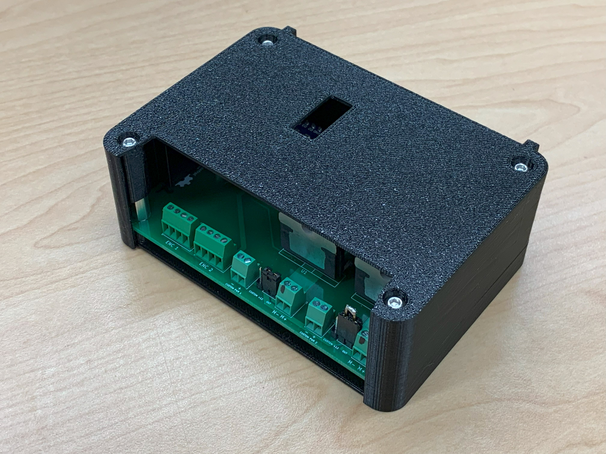
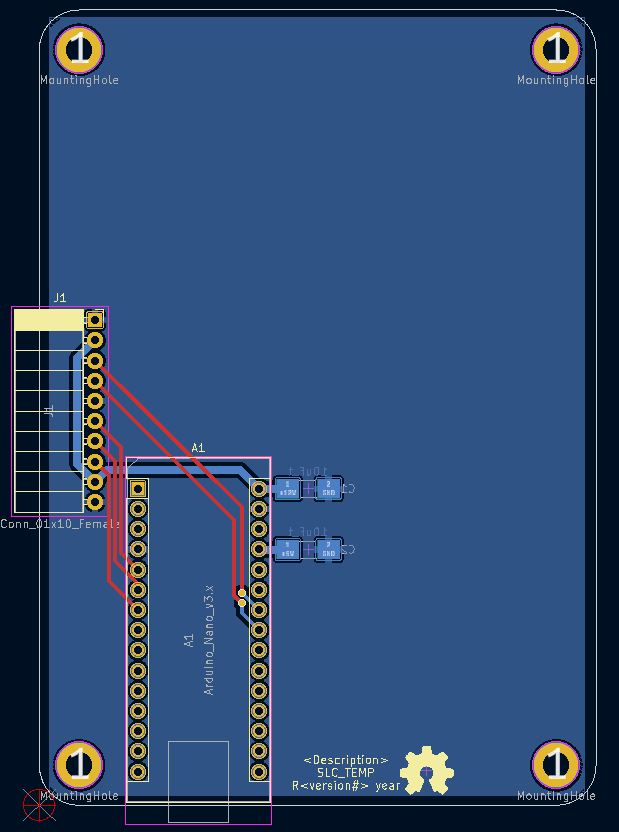

# BREAD Introduction

Welcome to the Broadly Reconfigurable and Expandable Automation Device (BREAD) project. This repository contains the files required to build your own supervisory control and data acquisition system or environmental sensing platform to suit your needs. Each function card, called a Slice, performs a specific function like temperature monitoring, DC motor control, relay control, etc. By linking Slices together with the Loaf backplane, you can create customized electronics to perform a variety of functions. This repository contains the bill of materials, board designs, 3D printable case design, and firmware examples for each Slice and the Loaf backplane.

## Navigating the repository

Each Slice and Loaf project is organized into the following files and subfolders:

-   Schematic.pdf: electrical schematic of the Slice in pdf format.
-   BOM_\<slice name\>.ods: bill of materials with links to purchase components on Digikey.
-   PCB Design: folder containing the KiCAD project files for the schematic and board design.
-   Gerbers: folder containing the gerber files extracted from the KiCAD board file. Use these files for manufacturing the PCB.
-   Firmware: folder containing examples and testing code unique to each Slice.
-   Mechanical: folder containing the 3D printable case files for each Slice.

## How to build a Slice

1.  Download all files from the Gerber folder. Compress files into a zip folder and upload to any PCB manufacturing company. If manufacturing the PCBs, use the “F_Cu.gbr” and “B_Cu.gbr” files for the front and back respectively.
2.  Order all components from the BOM file.
3.  Solder the components to the PCB starting with any SMD components and then through-hole components.
4.  3D print the case files using your favourite slicer.
5.  Assemble the case with the Slice hardware (finished PCB).

## How to build the Loaf

Follow the same steps as the Slice; however, the case takes more steps to assemble.

1.  Use hot glue to assemble the 2 bottom pieces and 2 top pieces of the case.

## Using the template to design new Slices

The template project (SLC_TEMP) provides a starting KiCAD project with the standard Slice components. The components should remain untouched, and designers should work around them when designing new Slices. Once finished with the board design, edit the Slice name, description, and version number to reflect the new Slice characteristics.

 
